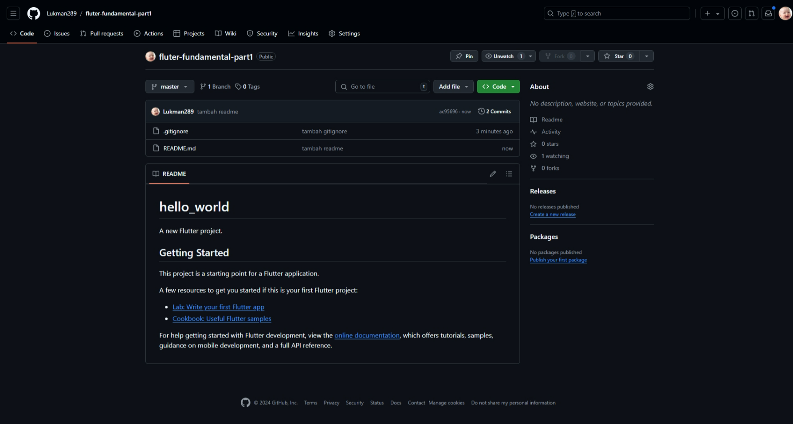

# hello_world

A new Flutter project.

## Getting Started

This project is a starting point for a Flutter application.

A few resources to get you started if this is your first Flutter project:

- [Lab: Write your first Flutter app](https://docs.flutter.dev/get-started/codelab)
- [Cookbook: Useful Flutter samples](https://docs.flutter.dev/cookbook)

For help getting started with Flutter development, view the
[online documentation](https://docs.flutter.dev/), which offers tutorials,
samples, guidance on mobile development, and a full API reference.

# Praktikum 1
## Langkah 1

```text
Membuat project baru pada Visual Studio Code
```
## Langkah 2

```text
Membuat folder untuk menyimpan project
```
## Langkah 3

```text
Memberikan nama pada project 
```
## Langkah 4

```text
Project flutter berhasil dibuat
```
# Praktikum 2
## Langkah 1

```text
Membuat repository baru di GitHub
```
## Langkah 2

```text
Menampilkan hasil repository yang telah dibuat
```
## Langkah 3

```text
Melakukan initialisasi project pada GitHub
```
## Langkah 4

```text
Mengunggah file gitignore
```
## Langkah 5

```text
Memberikan komen pada unggahan
```
## Langkah 6

```text
Mengupload file
```
## Langkah 7

```text
Membuat koneksi dengan GitHub
```
## Langkah 8

```text
Mengkoneksikan dengan link repository
```
## Langkah 9

```text
Mengupload file readme dengan langkah yang sama seperti langkah 4 
```
## Langkah 10

```text
Mengupload seluruh directory project ke repository GitHub
```
## Langkah 11

```text
Mengubah text dengan nama dan melakukan debugging pada program
```
## Langkah 12

```text
Screenshoot hasil running dan mengubah nama file menjadi 01.jpg
```

# Praktikum 3
## Langkah 1: Text Widget

```text
Membuat file baru untuk menampilkan text
```
## Langkah 2: Image Widget

```text
Membuat file baru untuk menampilkan gambar
```

# Praktikum 4
## Langkah 1: Cupertino Button dan Loading Bar

```text
Membuat widget dengan mengimport class dari material dan cupertino untuk menampilkan button dan loading bar
```
## Langkah 2: Floating Action Button (FAB)

```text
Membuat class baru untuk menampilkan Floating Action Button
```
## Langkah 3: Scaffold Widget

```text
Membuat scaffold untuk mengatur tata letak sesuai dengan material design
```
## Langkah 4: Dialog Widget

```text
Membuat 2 jenis widget dialog (AlertDialog dan SimpleDialog)
```
## Langkah 5: Input dan Selectoin Widget

```text
Membuat TextField untuk menginputkan teks
```
## Langkah 6: Date and Time Pickers

```text
Membuat button untuk menentukan tanggal dan jam
```

# Tugas Praktikum
1. Selesaikan Praktikum 1 sampai 4, lalu dokumentasikan dan push ke repository Anda berupa screenshot setiap hasil pekerjaan beserta penjelasannya di file README.md!
2. Pada praktikum 4 mulai dari Langkah 3 sampai 6, buatlah file widget tersendiri di folder basic_widgets, kemudian pada file main.dart cukup melakukan import widget sesuai masing-masing langkah tersebut!
3. Selesaikan Codelabs: Your first Flutter app, lalu buatlah laporan praktikumnya dan push ke repository GitHub Anda!
4. README.md berisi: capture hasil akhir tiap praktikum (side-by-side, bisa juga berupa file GIF agar terlihat proses perubahan ketika ada aksi dari pengguna) di browser dan perangkat fisik (device) dengan menampilkan NIM dan Nama Anda sebagai ciri pekerjaan Anda. Jika mode developer di perangkat HP Anda belum aktif, silakan cari di internet cara mengaktifkannya!
5. Kumpulkan berupa link repository/commit GitHub Anda ke tautan spreadsheet yang telah disepakati oleh dosen!

## Hasil Akhir Tugas Pertemuan 6
